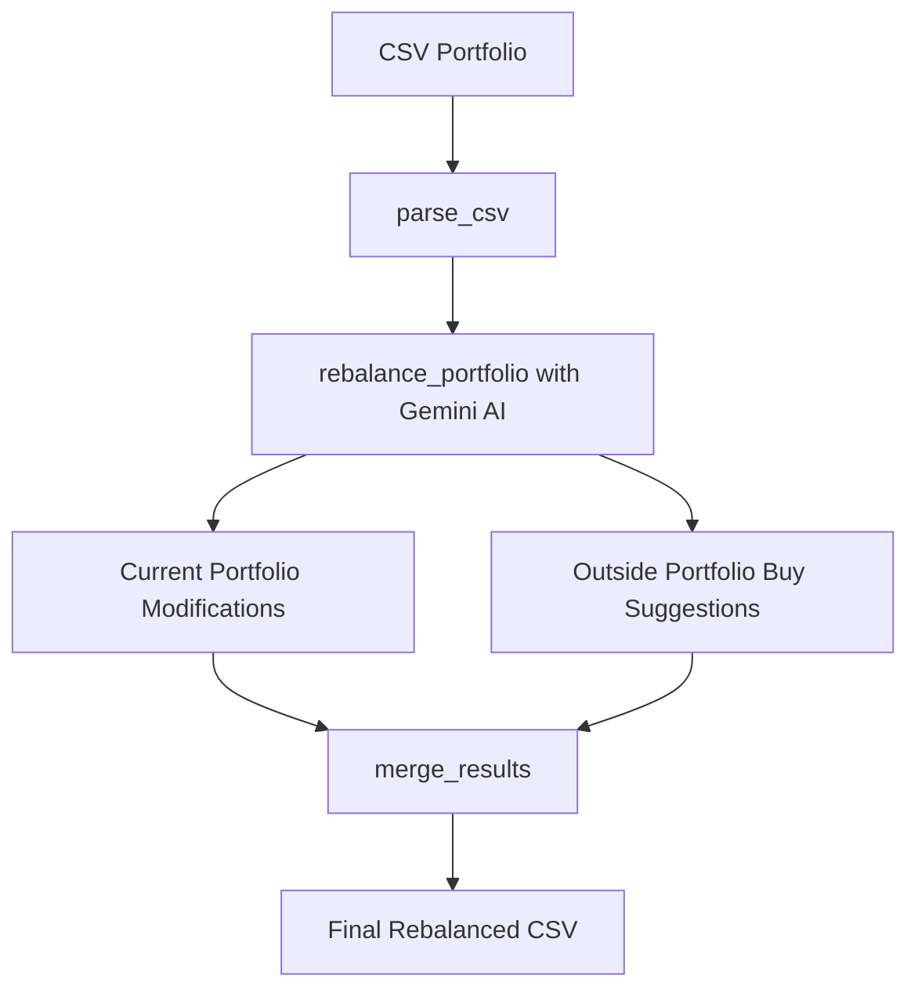

# 📊 Portfolio Rebalancer (AI-powered with Gemini)

This project is a simple AI tool that helps you **analyze and rebalance your stock portfolio** using **Google’s Gemini API**.

It:

1. Parses your **current portfolio CSV**.
2. Asks Gemini (acting as a chief financial planner) to:

   * Suggest **Buy / Sell / Hold** decisions for your current stocks.
   * Recommend **outside portfolio stocks** for diversification & long-term growth.
3. Outputs a **final CSV** with two sections:

   * **Current Portfolio Modifications**
   * **Outside Portfolio Buyable Stocks**

---

## 🚀 Features

* Simple **3-function workflow**:

  * `parse_csv(path)` → Reads portfolio CSV into a DataFrame.
  * `rebalance_portfolio(df, goal, invest_time, api_key)` → Uses Gemini for recommendations.
  * `merge_results(mods, buys, output_path)` → Combines both arrays into one CSV.
* Uses **Gemini-1.5-Pro** model for financial reasoning.
* Tested locally (no Colab needed).
* Easy to extend and integrate.

## ⚙️ How it Works



## 🛠️ Installation & Setup

### 1. Clone Repo

```bash
git clone https://github.com/sarthakbunny/portfolio-rebalancer.git
cd portfolio-rebalancer
```

### 2. Create Virtual Environment (optional but recommended)

```bash
python3 -m venv venv
source venv/bin/activate   # Mac/Linux
venv\Scripts\activate      # Windows
```

### 3. Install Dependencies

```bash
pip install -r requirements.txt
```

### 4. Set Your Gemini API Key

Create a \.env file and
```env
GEMINI_API_KEY = "GEMINI_API_KEY"
```

---

## 📊 Usage

### Input CSV Format

Your CSV should have the following columns:

```
Stock Name, ISIN, Quantity, Average buy price, Buy value, Closing price, Closing value, Unrealised P&L
```

✅ Example (`sample_portfolio.csv`):

```csv
Stock Name,ISIN,Quantity,Average buy price,Buy value,Closing price,Closing value,Unrealised P&L
ADANI POWER LTD,INE814H01011,25,519.59,12989.75,648.55,16213.75,3224
ASIAN PAINTS LTD,INE021A01026,10,3000,30000,3200,32000,2000
```

### Run the Tool

```bash
python main.py
```

---

## 📤 Output

The tool generates a **rebalanced\_portfolio.csv** with two sections:

### Example Output

```csv
Stock Name,Stock Symbol,Action,Units,Reason,Section
ADANI POWER LTD,INE814H01011,Hold,0,"Good long-term play on energy",Current Portfolio
ASIAN PAINTS LTD,INE021A01026,Sell,5,"Reduce exposure due to overvaluation",Current Portfolio
HDFC BANK LTD,HDFCBANK,Buy,15,"Strong fundamentals and consistent growth",Outside Portfolio
INFOSYS LTD,INFY,Buy,10,"Diversification into IT sector",Outside Portfolio
```

---

## ⚡ Roadmap

* [ ] Add sector-wise diversification analysis
* [ ] Integrate live stock market data for more realistic recommendations
* [ ] Build a simple **Streamlit UI** for non-developers

---

## 📝 License

MIT License © 2025
